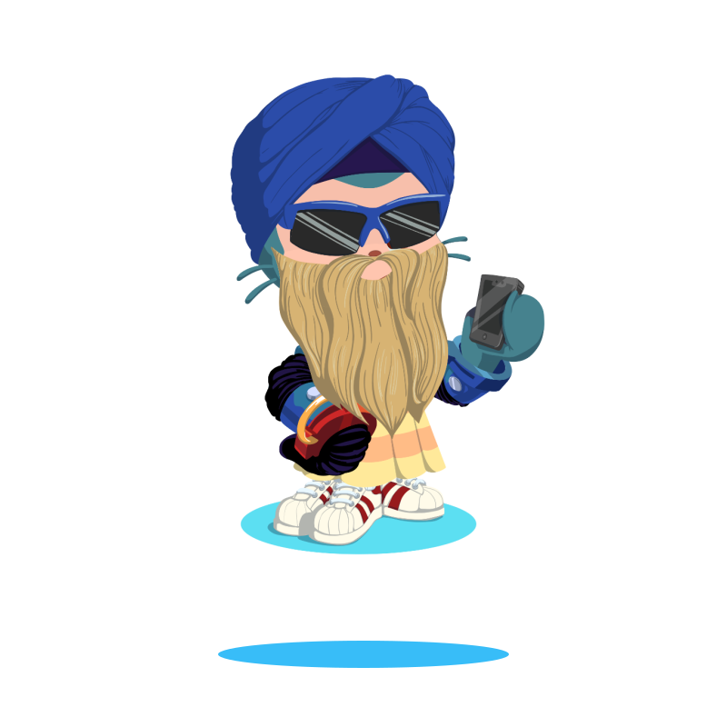

  

  

  
  
  

---

<table border="0" width="100%">
  <tr>
    <td width="65%" valign="top">
      <h3>About Me</h3>
      
I am an AI & Data Science Engineer and Microsoft-Certified Data Engineer based in Giza, Egypt. I specialize in building end-to-end intelligent systems, fine-tuning large language models, designing robust data pipelines, and developing high-performance search engines.

      
<strong>Location:</strong> Giza, Egypt

      
<strong>Focus Areas:</strong> Generative AI, Search Systems, and Data Engineering

    </td>
    <td width="35%" align="center" valign="middle">
      
    </td>
  </tr>
</table>

---

### Technical Expertise

- **Languages:**    
- **AI & Machine Learning:**      
- **Backend & Databases:**    
- **Frontend & Visualization:**   
- **Automation & Scraping:**   
- **Cloud & DevOps:** 

---

### Featured Projects

- **CineMatch AI** — FastAPI, PyTorch, Supabase, SBERT, SVD recommendation system.
- **Football Search Engine** — TF-IDF, Word2Vec, semantic search, DuckDB, Streamlit, SerpAPI.
- **Gemma-4 Fine-Tuning Pipeline** — LoRA, HuggingFace PEFT, NVFP4, vLLM (paid client work).
- **Premier League Analytics Dashboard** — AmCharts 5, data visualization.
- **Mowasla** — Uber-like ride-hailing system in C# + SQL.

---

### GitHub Performance Metrics

  
  

---

  Developed by Omar Alghannam

